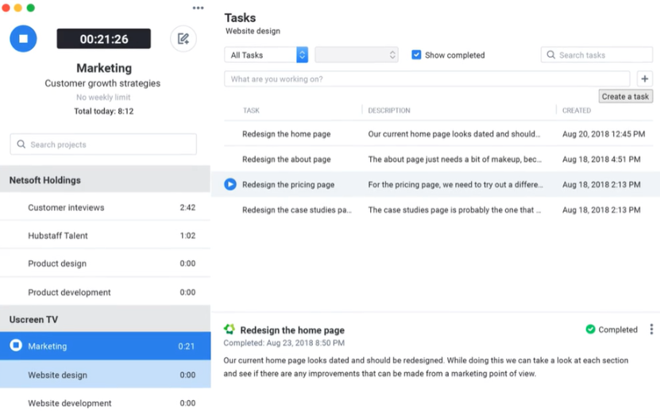
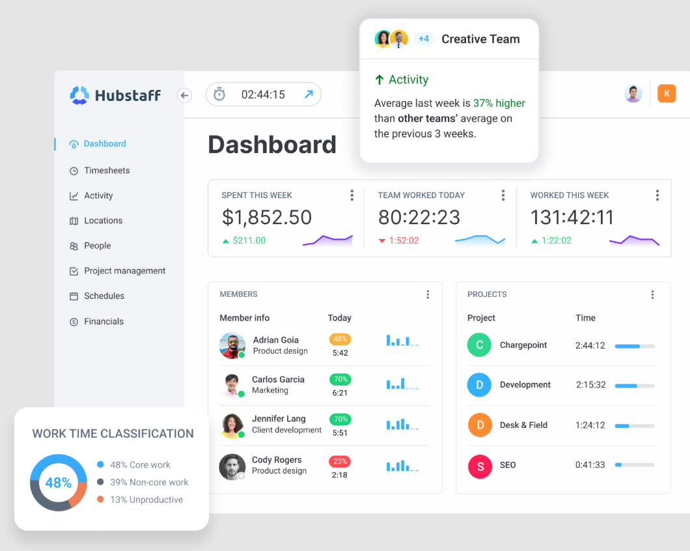
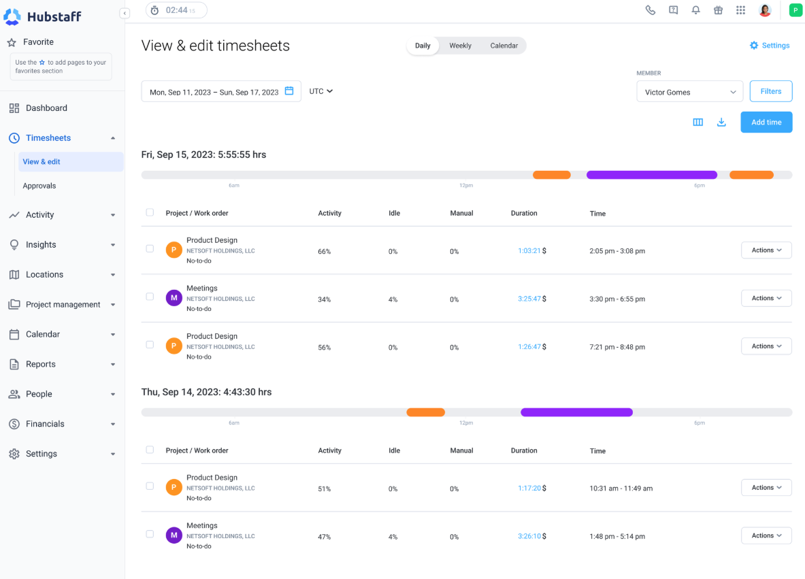

  <!-- LOGO PLACEHOLDER -->
  

  # Intelfin Multiplatform
  
  **Automated Crypto Trading Ecosystem • Hybrid Intelligence • Blockchain**

  
  
  
  

  

    Use the mathematical advantage. Fully automated trading for investors, financial managers, and enterprises.
  

  

    <a href="#about">About</a> •
    <a href="#core-technology">Core Technology</a> •
    <a href="#dashboard">Dashboard</a> •
    <a href="#strategies">Strategies</a>
  

---

## 🌐 About The Platform

**Intelfin** uses blockchain technology and hybrid intelligence to create a fully automated and highly responsive trading ecosystem. 

Designed for scalability, it helps aspiring and practicing investors, financial managers, and companies succeed in the digital asset markets easily and confidently. We replace emotional trading with mathematical precision.

---

## 💻 Dashboard & Performance

  <!-- SCREENSHOT PLACEHOLDER 1 -->
  
   
  <em>Real-time market analysis and automated bot performance tracking.</em>

---

## 🚀 Core Technology

### ⚡ The Arbitrage Bot
*   **Milliseconds Execution:** Buy and sell assets in fractions of a second.
*   **Market Exploitation:** Capitalize on price discrepancies of altcoins between different exchanges.
*   **Guaranteed Edge:** Our bot finds the most profitable opportunities that are impossible for humans to catch manually.

### 🧠 The Hybrid Bot
*   **Dynamic Adaptation:** Combines several strategies at once depending on the current market situation.
*   **Advanced Algorithms:**
    *   *High-Frequency Trading (HFT)*
    *   *Fork-medium algorithms*
*   **Response:** "Your wish alone won't do the job." Our system proactively reacts to volatility to maximize returns.

---

## 📊 Visual Analytics

| Performance Graph | Bot Settings |
|:---:|:---:|
| <!-- SCREENSHOT PLACEHOLDER 2 -->  | <!-- SCREENSHOT PLACEHOLDER 3 -->  |

> *Monitor your portfolio growth and configure algorithmic strategies with ease.*

---

## 🔒 Security & Architecture

*   **Blockchain Integration:** Ensures transparency and security of operations.
*   **Non-Custodial Logic:** (Add details if applicable)
*   **Enterprise Grade:** Built to handle high loads and institutional-level transactions.

---

  © 2025 Intelfin Multiplatform. Powered by Math & Intelligence.

